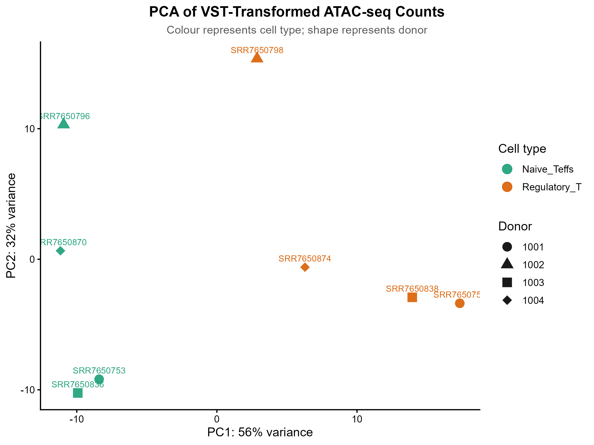
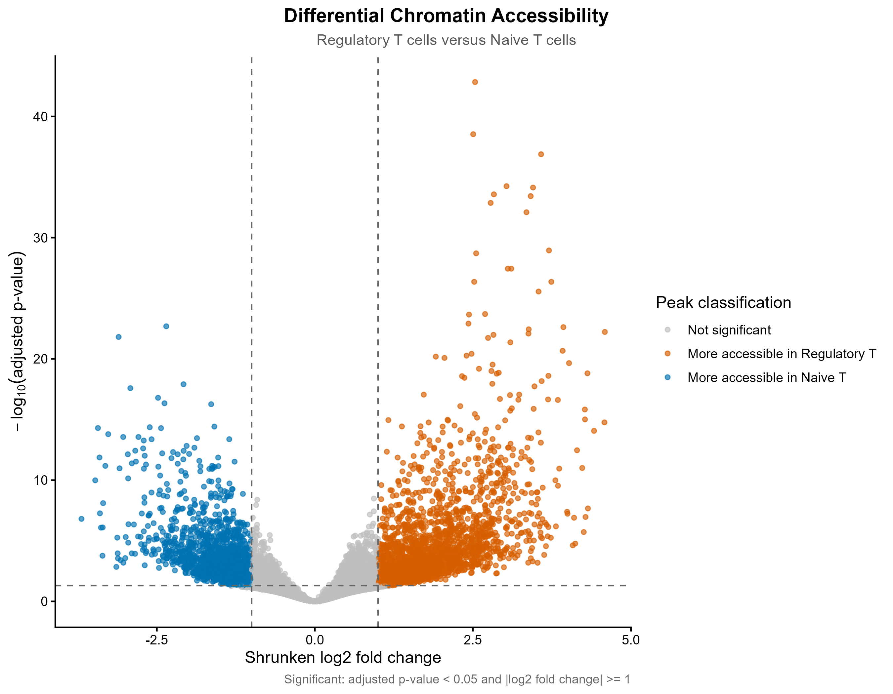
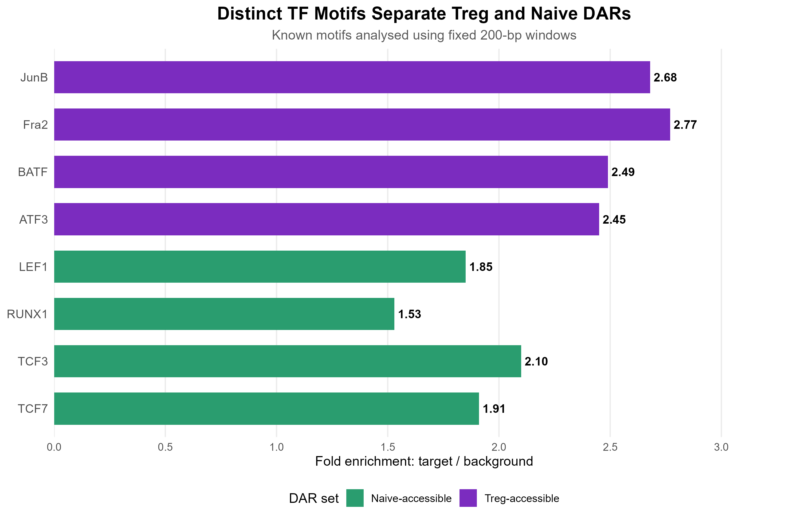

# ATAC-seq: Regulatory vs Naive CD4+ T Cells

Systems Biology project at the University of Göttingen.
I analysed public bulk ATAC-seq data from [Calderon et al. (2019)](https://doi.org/10.1038/s41588-019-0505-9)
to compare chromatin accessibility between regulatory T cells and naive
conventional CD4+ T cells from four paired human donors.

This repository shares the analysis code and results for portfolio use and
open-source reuse.

## Tools and workflow

- **Bash:** FastQC, Cutadapt, Bowtie2, SAMtools, Picard, MACS2, bedtools, featureCounts and HOMER.
- **R:** DESeq2, apeglm, ChIPseeker, clusterProfiler and ggplot2.

Preprocessing and QC → consensus peaks and fragment counts → differential
accessibility → peak annotation, GO enrichment and motif analysis.
Week 1 used a separate chromosome-22 teaching sample. The main comparison
used whole-genome preprocessed data from eight samples.

## Results

These numbers describe the saved internship analysis.

| Result | Number |
| --- | ---: |
| Consensus peaks | 108,176 |
| Peaks tested | 50,986 |
| Significant DARs | 4,156 |
| More accessible in regulatory T cells | 2,521 |
| More accessible in naive CD4+ T cells | 1,635 |

Significant regions have adjusted p-value < 0.05 and absolute shrunken log2
fold change ≥ 1. Positive fold changes indicate greater accessibility in Tregs.





AP-1/BATF-family motifs were enriched in Treg-accessible regions; LEF/TCF- and
RUNX-family motifs were enriched in naive-accessible regions. These are sequence
associations, rather than direct evidence of transcription-factor binding.



## Code and files

| Stage | Script | Purpose |
| --- | --- | --- |
| Separate teaching exercise | [00_week1_chr22_training.sh](scripts/00_week1_chr22_training.sh) | Chromosome-22 preprocessing and QC |
| 1 | [01_consensus_peaks.sh](scripts/01_consensus_peaks.sh) | Merge broad peaks and convert BED to SAF |
| 2 | [02_count_fragments.sh](scripts/02_count_fragments.sh) | Count paired fragments with featureCounts |
| 3 | [differential_accessibility.R](scripts/differential_accessibility.R) | Paired-donor DESeq2 analysis and QC plots |
| 4 | [peak_annotation_GO_and_HOMER_input.R](scripts/peak_annotation_GO_and_HOMER_input.R) | Genomic annotation, GO enrichment and motif input sets |
| 5 | [05_homer_motifs.sh](scripts/05_homer_motifs.sh) | Fixed 200-bp motif analysis with matched backgrounds |
| 6 | [HOMER_summary_and_plots.R](scripts/HOMER_summary_and_plots.R) | Summarise known motifs and plot enrichment |

- `input/` — supplied count matrix, consensus peaks and eight-sample metadata.
- `results/figures/` and `results/tables/` — saved analysis results.
- `results/motifs/` and `results/motif_peak_analysis/` — saved HOMER outputs and follow-up tables.
- `results/qc/` — MultiQC from the separate Week 1 teaching sample.

- `scripts/recorded/` — recovered Week 2 Bash command bodies with configurable paths.

The R scripts retain the supplied analysis with portable paths and input checks.
The Week 1 and Week 2 Bash scripts adapt commands recovered from the saved July
workflows. The HOMER runner is reconstructed from the supplied inputs and
recorded methods; its complete historical shell transcript has not been recovered.

## Run the analysis

From the repository root, with the required R packages installed:

```bash
Rscript scripts/differential_accessibility.R
Rscript scripts/peak_annotation_GO_and_HOMER_input.R
Rscript scripts/HOMER_summary_and_plots.R
```

New outputs go to `runs/local/`. The last script summarises existing HOMER results.
See [script instructions](scripts/README.md) for dependencies, rebuilding counts,
rerunning HOMER and the separate Week 1 exercise.

The main Bash consensus script corrects the historical BED-to-SAF start-coordinate
conversion. Saved results remain the original analysis snapshot; the impact of
recounting with corrected coordinates has not been assessed. Public Bash scripts
have not been rerun against the original upstream data.

## License

The analysis code and documentation are available under the [MIT license](LICENSE).
You may use, modify and share the code while retaining its copyright and license
notice. Third-party data, software and motif resources retain their applicable
terms; see [sources and reuse](NOTICE.md).

**Natasha Machate · [KitCatasha](https://github.com/KitCatasha)**
